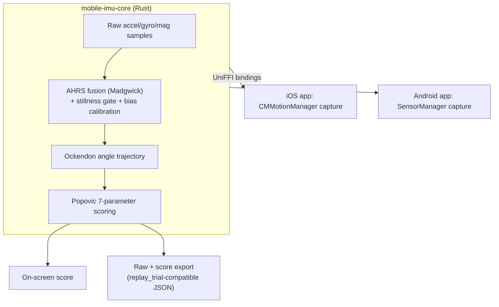

<!-- /autoplan restore point: /c/Users/cladi/.gstack/projects/cekennedy04-Pendulastic/main-autoplan-restore-20260821-140929.md -->
---
title: Phone IMU Pendulum App - Plan
type: feat
date: 2026-08-21
topic: phone-imu-pendulum-app
artifact_contract: ce-unified-plan/v1
artifact_readiness: implementation-ready
product_contract_source: ce-brainstorm
execution: code
---

# Phone IMU Pendulum App - Plan

## Goal Capsule

- **Objective:** Build a standalone, cross-platform (iOS + Android) mobile app that records and scores the Wartenberg pendulum test entirely on-device via the phone's IMU, removing the desktop/IMU-server/OptiTrack dependency from the deployed workflow.
- **Product authority:** This plan owns the IMU-only, phone-only pathway. The existing markerless/RGB pipeline (desktop) and the existing `mobile/` React Native app (the RGB pathway's phone client) are unaffected and are not active scope here.
- **Open blockers:** None.
- **Product Contract preservation:** Restructured, no product-scope change — `KTD2` changed from a WASM shared core to Rust + UniFFI as the cross-platform mechanism, per external research showing WASM has no production-viable iOS runtime. The product-level decision it governs (separate native shells, not the existing React Native app) is unchanged and was explicitly reaffirmed after discovering the `mobile/` RN precedent.

---

## Product Contract

### Summary

A cross-platform mobile app (iOS + Android) that captures a Wartenberg pendulum test swing on the phone's built-in IMU and computes the same Popović 7-parameter spasticity score the desktop pipeline produces today, with recording, sensor fusion, and scoring happening entirely on-device — no laptop, IMU-server, or OptiTrack involved. Native capture/UI per platform, backed by a single Rust scoring core shared via UniFFI-generated Swift and Kotlin bindings, so the algorithm isn't reimplemented twice.

### Problem Frame

Today, delivering a pendulum test measurement requires a laptop running `pendulastic_app.py` / `master_app.py`, a phone streaming raw IMU data via a third-party app (Sensor Stream Pro) over the local network to `pendulastic_imu_server.py`, and, for validation, an 8-camera OptiTrack rig. This is heavy to bring into a clinic or research site that isn't the primary dev environment, and every deployment inherits the dependency on desktop hardware, local network configuration, and firewall rules (per `pendulastic-developer-spec.md` §5.1). Removing the desktop from the loop would let a clinician run the test with just a phone.

### Key Decisions

- KTD1. **IMU-only for v1; the RGB/markerless pathway is not ported.** Keeps this plan to a single algorithm port instead of two. The desktop's markerless video track, and the existing `mobile/` RN app that already serves it, remain separate and unaffected. *(session-settled: user-directed — chosen over "both from the start" and "RGB only")*
- KTD2. **Native iOS/Android shells with one shared Rust core, exposed via UniFFI-generated Swift and Kotlin bindings** — not WASM, and not the existing `mobile/` React Native app. Native shells preserve raw sensor-timing fidelity, which matters given how timing-sensitive the desktop's stillness-gate/accel-bias correction already proved to be. UniFFI (Mozilla's production pattern, used in Firefox for Android/iOS) gives direct native FFI calls with no runtime to embed — a WASM core was considered first, but rejected once research showed no iOS app store WASM runtime is production-viable (third-party apps can't JIT; the only iOS option, WasmKit, is an unproven pure-Swift interpreter). Reusing the `mobile/` RN app was also considered and explicitly rejected: it's a mature, working app shell, but it's built for the RGB pathway, and folding an unrelated IMU pathway into it would mean maintaining a mixed-modality app rather than a clean separation. *(session-settled: user-directed — chosen over React Native reuse, and over the originally-proposed WASM mechanism, after research)* Governs R1, R4, R6.
- KTD3. **v1 succeeds on a standalone record-then-score loop, not accuracy parity with the desktop — but that loop is validated by a hard, threshold-gated shadow study before native platform work scales.** A clinician can run a full test on the phone alone and see the 7-parameter score; full validation against the desktop/OptiTrack pipeline stays deferred to future work. This plan does include a **cross-platform parity check** (U7) — proving the ported core itself is internally consistent across iOS and Android — which is distinct from, and doesn't reopen, the deferred desktop-accuracy question. A **shadow-study gate** (~20-30 trials, phone and the existing pipeline recorded simultaneously) runs as soon as U0's minimal capture harness and U1+U2 land, scored against predefined pass/fail thresholds derived from the existing pipeline's own repeatability error — not a vague "compare and see." U0 (not U3's real UniFFI/native apps, and not the existing networked Sensor-Stream-Pro path) supplies the real phone-captured data — see U0's own rationale for why the existing networked path doesn't substitute here. **U3 (UniFFI bindings/cross-compile) and every downstream unit do not start until the gate passes.** A failure routes back to U1/U2 fidelity work while only U0's throwaway harness and two Rust modules exist, not after two full native app shells are already built on top of them. This also doubles as an early real-world exercise of KTD4's export format. *(session-settled: user-directed, revised 2026-08-21 per a convergent CEO-review finding — Claude and Codex, independently, both flagged the original early-but-non-blocking shadow study as too weak relative to the scale of the downstream native investment; further revised same day per an Eng-review finding — Codex found the gate as first written had no way to actually capture real phone data before any app existed, resolved by adding U0)* Governs R5, U0, U3.
- KTD4. **The raw IMU stream is saved alongside the on-device score**, in a format the existing Python `imu_calibration_tuner.py`'s `replay_trial()` can consume directly, so future accuracy validation doesn't require re-recording. *(session-settled: user-directed)* Governs R6.
- KTD5. **Raw sensor capture uses each platform's standard high-rate listener** (iOS `CMMotionManager` raw streams, Android `SensorManager.registerListener`), not iOS's newer 800Hz `CMBatchedSensorManager` API or Android's `SensorDirectChannel`. Pendulum swings are low-frequency motion (~1-3 Hz); the ~100Hz range both standard APIs support is already more than the desktop pipeline works with. `SensorDirectChannel` in particular caps near 50Hz and targets a different (zero-copy, gaming/VR) use case. Governs R1.
- KTD6. **Visual design system (color, typography, iconography) is deferred to a future `/design-consultation` pass.** This plan specifies functional and accessibility requirements (R9) but not a visual identity, since no `DESIGN.md` exists yet for this project. *(session-settled: user-directed — chosen over baking a clinical/utility direction into this plan now)*
- KTD7. **Every fallible call across the UniFFI boundary returns a typed `Result`/error, never a Rust panic.** Without this, a malformed sample buffer could crash the host app instead of surfacing the "couldn't compute a score" error state already specified. *(session-settled: user-directed)* Governs U3.
- KTD8. **Distribution for this research-stage app is manual TestFlight (iOS) and Firebase App Distribution or a direct APK (Android) — no App Store/Play Store submission.** Unblocks U4/U5's "physical device" verification without requiring store review for a clinical research tool not yet ready for public distribution. *(session-settled: user-directed)*
- KTD9. **The release/zero point is auto-detected by porting the reference's calm-then-departure gyro-threshold state machine** (`calm_qualified`/`pending_departure`, `_ZERO_CAPTURE_GUARD_RAD_S`, distinct from the simpler `is_stationary()` bias-calibration gate), not a manual clinician tap. `mark_release()` (live, used only during recording, e.g. if a clinician wants to mark it deliberately in the moment) and `set_release_override(sample_id)` (retroactive — see below) are optional manual overrides, not the primary mechanism — matching the reference's actual zero-point definition so scores stay comparable for future validation (R6). **The `ReleaseNeverDetected` recovery path is retroactive, not a live re-tap:** by the time that error can fire, the trial has already been recorded and settled — the raw sample buffer already exists — so re-recording from scratch would needlessly discard captured data. The clinician scrubs the already-recorded waveform and taps the point they judge as release; that tap resolves to a specific `sample_id` in the stored buffer, passed to `set_release_override(sample_id)` (U3), which deterministically recomputes `compute_score()` against that same buffer with the manually-placed release point — not a fresh capture, and not `mark_release()` itself, which has no mechanism to specify a point on an already-finished recording. *(session-settled: user-directed; retroactive-not-live-relocation clarified 2026-08-21 per a Codex design-review finding — the original live-re-tap phrasing was incoherent given release detection can only fail after the swing is already over; `set_release_override(sample_id)` API mechanism added same day per a Codex eng-review finding — `mark_release()` alone cannot express "at this point in an already-recorded buffer")* Governs U1, U3.
- KTD10. **Algorithm-fidelity corrections found by outside-voice review, verified against the code:** magnetometer is captured but excluded from fusion correction (matching the live desktop path's deliberate exclusion); accelerometer units are normalized per-platform (g's on iOS, m/s² on Android) before fusion; U2 resamples to the reference's fixed 50ms tick + EMA cadence before scoring, rather than operating on raw irregular samples directly. No explicit cross-platform coordinate-axis convention is needed beyond unit normalization, since the zero()-referenced design (KTD9) measures rotation-from-calibrated-zero. *(session-settled: user-directed)* Governs U1, U2.
- KTD11. **A capture-acceptance quality gate distinguishes "no usable signal" from "usable signal, wrong result."** `TrialError` (`ReleaseNeverDetected`/`DidNotTrackSwing`/`InsufficientSamples`, KTD9) already answers "could a score be computed at all" — but a technically-valid trial can still be clinically-garbage (loose strap, gaps in the sample stream) and today the plan would score it with no warning. Every successfully-computed score therefore carries a `capture_quality` assessment, checked against: (a) **sensor-stream completeness** — gaps in timestamped delivery beyond the expected ~100Hz cadence, derivable directly from the raw sample stream with no clinical judgment required; (b) **attachment-stability** — high-frequency jitter inconsistent with a rigid mount, measured as the residual between the raw signal and U2's own Savitzky-Golay-smoothed output; (c) **swing-range plausibility** — first-flexion amplitude outside a physiologically expected range. This KTD specifies the checks and where their data comes from, not final numeric thresholds for (b) and (c) — those are calibrated from the KTD3 shadow study's real trial data (Outstanding Question, below), not guessed at in this planning pass. *(session-settled: user-directed)* Governs R14, U13.

### Requirements

**Capture**
- R1. The app records raw accelerometer, gyroscope, and magnetometer data from the phone's built-in IMU during a pendulum test trial, on both iOS and Android, using each sample's own sensor timestamp (not arrival time or a nominal fixed period) for all timing math — the three streams arrive independently and are not hardware-synchronized.
- R2. The app provides a way to mark the start (release) and end (settled) of a trial, consistent with the stillness-gated release detection the desktop pipeline uses (per `pendulastic-developer-spec.md` §3.1).
- R3. The app supports the same auto-tare/zero-point calibration step the desktop pipeline uses before a trial begins (per `pendulastic-developer-spec.md` §3.2).

**Scoring**
- R4. The app computes the Popović 7-parameter score (relaxation index, number of swings, first flexion rebound, max/min angular velocity, oscillation frequency, symmetry ratio) from the recorded IMU trial, on-device, with no network call.
- R5. A clinician can complete a full trial — record, then review the score — entirely on the phone, without any desktop, IMU-server, or OptiTrack component involved.

**Data**
- R6. Each completed trial saves both the computed score and the raw IMU stream (timestamped accelerometer/gyroscope/magnetometer samples) locally on the device, tagged with the selected participant (R7), exportable via the platform's native share mechanism, in a form `imu_calibration_tuner.py`'s `replay_trial()` can consume without a format conversion.

**Participant Management**
- R7. Before starting a trial, the clinician selects or creates a participant from a local, on-device list; the completed trial is tagged with that participant.

**Presentation**
- R8. The review screen displays the 7 computed parameters together with a chart of the angle-vs-time swing waveform they were derived from.

**Accessibility**
- R9. All screens use touch targets of at least 44pt/dp with adequate spacing to prevent accidental adjacent-control taps (relevant here specifically because the phone is physically strapped to a moving leg during capture), support fully one-handed operation with primary/destructive controls placed within comfortable reach, and meet WCAG AA (4.5:1) contrast for all text and non-text confidence/error indicators (never color alone — e.g. the repeatability/low-confidence indicator (U10) and error states need a shape/icon/text signal, not just a red vs. green fill). VoiceOver/TalkBack labels, roles, and a sensible focus order are specified for every screen, not left to platform defaults; the app supports OS-level dynamic type/font scaling without clipping or hiding controls; the waveform chart (R8) and trend chart (U11) each have a text/table alternative, not a chart-only presentation; calibration, recording, trial transitions, scoring, and export each announce their state changes to assistive tech (e.g. "Trial 2 of 3 saved"), not just visually.
- R15. Phone-only, portrait-primary for the capture flow (the phone is strapped to a shank during capture, where an orientation change is a device event to survive per R1's timestamp handling, not a layout mode to design for) — landscape and tablet layouts are explicitly out of scope for v1 (see Scope Boundaries), not an unstated gap.

**Measurement Protocol**
- R10. Before the first capture of a session, the app shows the clinician a mounting guide: the phone must be rigidly, non-slippingly attached to the shank, and the zero/tare step (R3) must be performed with the leg in the correct reference posture — since the underlying model (`ockendon_deg`/`_beta_from_quats`) measures rotation magnitude from that zero pose, not an absolute gravity angle, mounting axis/face is secondary to rigidity and correct zeroing.
- R11. Each capture session runs 3 automatic trials rather than one, reporting the median score plus a repeatability/confidence indicator across the three — increasing single-visit clinical trust without requiring the desktop-accuracy validation KTD3 defers. *(session-settled: user-directed, added via /plan-ceo-review selective-expansion cherry-pick)*

**Longitudinal View**
- R12. For a selected participant, the app shows a trend of past trial scores across sessions over time, not just the most recent trial. *(session-settled: user-directed, added via /plan-ceo-review selective-expansion cherry-pick)*

**Clinical Export**
- R13. A completed trial can be exported as a one-page clinical PDF summary (score, waveform, participant) in addition to the raw JSON export (R6). *(session-settled: user-directed, added via /plan-ceo-review selective-expansion cherry-pick)*

**Trial Quality**
- R14. Every computed score carries a `capture_quality` flag (Clean, or LowConfidence with a reason drawn from KTD11's checks) distinct from an outright `TrialError`. A low-confidence trial is still shown to the clinician with its score, but visibly flagged — never presented as equivalent to a clean trial. *(session-settled: user-directed, resolves the TODOS.md capture-acceptance-criteria item raised by outside-voice CEO review)*

### Scope Boundaries

*Deferred for later:*
- RGB/markerless camera-based pathway — not ported to phone in this plan.
- Accuracy validation of the on-device score against the desktop pipeline or OptiTrack — enabled by R6's raw export, but not performed as part of this work.
- Cloud sync or any server-side component for trial data.
- Visual design system (colors, typography, iconography, illustration) — no `DESIGN.md` exists yet; recommend running `/design-consultation` before finalizing the visual language (KTD6). This plan specifies functional/accessibility requirements only.
- Landscape orientation and tablet layouts (R15) — v1 is phone-only, portrait-primary for the capture flow. Flagged by design review as a real gap if left unstated; resolved here as an explicit scope decision, not an oversight.

*Outside this plan's identity:*
- OptiTrack integration — remains a desktop-only research/validation tool.
- The existing `mobile/` React Native app — that's the RGB pathway's client; this plan builds a separate app for the IMU pathway.
- Patient self-administration, IRB/compliance design — the actor for this app is the same clinician/researcher who operates the desktop pipeline today.
- Data-governance mechanics for locally-stored participant records + raw motion export (encryption at rest, retention/deletion policy, lost-device posture, export audit trail) — flagged by CEO review as a real operational gap that "research-stage, IRB out of scope" doesn't remove, but resolving it is a compliance/ops decision outside this plan's engineering scope. Tracked in TODOS.md rather than blocking this plan.

### Dependencies / Assumptions

- Assumes the existing Python AHRS sensor-fusion and Popović-scoring logic in `pendulastic_imu_server.py` / `imu_calibration_tuner.py` is the reference implementation the on-device core is ported from.
- Assumes physical iOS and Android devices are available for testing — the iOS Simulator has no real accelerometer/gyroscope/magnetometer, so this app's core behavior cannot be exercised in simulator-only automation.
- Distribution (KTD8): manual TestFlight for iOS, Firebase App Distribution or a direct APK for Android — required to get builds onto the physical test devices Definition of Done depends on.

### Sources / Research

- `README.md` — current two-track architecture (markerless video vs. IMU) and research aims.
- `pendulastic-developer-spec.md` §§1.1, 3.1-3.3, 4, 5.1 — hardware/network context, stillness-gate/auto-tare algorithms, Popović 7-parameter engine spec, IMU server networking constraints.
- `pendulastic_imu_server.py` — reference implementation: `MadgwickAHRS` (L134-248), stillness detection (L306-333, L509-513), `calibrate_gyro_bias`/`calibrate_accel_bias` (L446-508), `zero()`/`clear_zero()` (L799-854), raw log format (L998-1048).
- `imu_calibration_tuner.py` — reference implementation: `ockendon_deg` (L84), `score_waveform` (L466-602), `replay_trial` (L174) as the future validation entry point.
- `mobile/` (existing React Native/Expo app) — confirmed as the RGB pathway's client only; no IMU code present; informed the KTD2 decision to keep this work separate.
- External research (2026-08): iOS third-party apps cannot JIT, ruling out production WASM runtimes on iOS; UniFFI is Mozilla's production pattern for sharing a Rust core into Swift/Kotlin; `CMMotionManager` raw streams and Android `SensorManager.registerListener` are the correct high-rate IMU APIs, with per-sample timestamps (not arrival time) required for `dt` math on both platforms.
- [phyphox](https://phyphox.org) — open-source iOS/Android sensor-data app; confirmed via `/office-hours` as a legitimate prototyping/benchmark reference (raw sensor capture, on-device analysis graph), not a production dependency — the clinical-specific algorithm work (Ockendon fidelity, release-detection state machine, Popović scoring, replay-compatible export) has no OSS equivalent.

---

## Planning Contract

### High-Level Technical Design



Data flows one direction: each platform's native capture layer feeds raw, independently-timestamped samples into the shared Rust core; the core owns fusion, calibration, and scoring; each platform's UI only renders the result and triggers export.

### Data Model (resolves an Eng-review finding)

U6/U10/U11/U12 each assumed a persistence shape without one being defined anywhere, which Eng review flagged as a real gap — U10 produces 3 trials per session, U11 needs to read session-level history, U12 exports "a completed trial" from a session-oriented review screen. One hierarchy, defined once here, that every unit reads from:

```
Participant (U8)
  └── Session (one mounting-guide/calibration cycle, U9/U10)
        ├── session_id (immutable, generated at session start)
        ├── started_at (wall-clock timestamp, session creation time)
        ├── status: InProgress | Complete (3/3 trials) | EndedEarly (1-2/3 trials)
        └── Trial × 1-3 (U1-U3)
              ├── trial_id (immutable, generated at trial start)
              ├── raw_samples (U0/U1's timestamped accel/gyro/mag stream)
              ├── score: ScoreResult (7 params + capture_quality, U2/U13) | None (if TrialError)
              └── release_override: sample_id | None (U3's set_release_override, if used)
```

- **U6's raw export** persists one **Trial** (its raw samples + score + participant tag) — the format `replay_trial()` already expects a single trial's worth of data, so this doesn't change.
- **U10's median/repeatability** is computed over a **Session's** trials, never persisted as its own record — it's derived fresh from the session's Trial scores each time it's displayed, so there's no separate "session score" to keep in sync with its trials.
- **U11's trend view** reads **Session** history per participant (one point per session, per the session-median fix above), using `started_at` for chronological ordering and `status` to distinguish complete from early-ended sessions.
- **U12's PDF export** is per-**Session** (the median result a clinician actually reviews), not per-Trial — matching what U10 made the Review screen's primary view; exporting an individual trial's PDF is not in scope for v1 (the raw-JSON path, U6, already covers per-trial export for anyone who needs it).
- IDs are generated locally (e.g. UUID) at creation time — no server, no collision risk across devices to worry about for v1.

### Screen Flow

```
  ┌────────────────┐
  │ Participant     │  (empty state: "No participants yet" + add action)
  │ select (U8)     │
  └───────┬────────┘
          │ select/create participant
          ▼
  ┌────────────────┐
  │ Mounting guide  │  once per session — first capture only. Requires an
  │ (U9)            │  explicit "phone is securely attached" confirmation
  └───────┬────────┘  before proceeding, not a passive dismiss (R10 is
          │ confirm    clinically load-bearing — a passed-over guide is
          ▼            not the same as an acknowledged one)
  ┌────────────────┐     retry on error
  │ Calibrate/zero  │◀───────────────────┐
  │ (once per       │                     │   Runs ONCE for the whole
  │  session, R3)   │                     │   3-trial protocol, not
  └───────┬────────┘                     │   re-verified per trial —
          │ ready                         │   the phone is assumed to
          ▼                               │   stay mounted between the
  ┌────────────────┐  fail this trial-┘   │   3 trials of one session
  │ Recording       │  only, keep set──────┘   (see U10 Approach)
  │ (trial N of 3)  │
  └───────┬────────┘
          │ mark settled
          ▼
  ┌────────────────┐
  │ Trial N saved — │  explicit post-trial state (not silent) — shows
  │ reposition for  │  trial N's own result, an end-protocol-early action,
  │ trial N+1       │  and an explicit "Arm next trial" action. Recording
  └───────┬────────┘  does NOT auto-resume: repositioning is motion too,
          │ arm next    and capturing it inside trial N+1's buffer would
          │ trial       corrupt both the score and U13's quality gate.
          ▼             N<3 loops to Recording; N=3 proceeds below.
  ┌────────────────┐
  │ Review          │  primary: median + repeatability indicator (R8).
  │ (median view,   │  3 individual trials: one tap away via disclosure,
  │  R8)            │  not co-equal with the median (see U10 Approach)
  └───┬────────┬────┘
      │        │
      │        └──▶ ┌────────────────┐
      │              │ Trend view (U11)│  one point per SESSION (its
      │              │                 │  median, not 3 points/visit) —
      │              └────────────────┘  empty: "No trend yet" if 0-1 sessions
      ▼
  ┌────────────────┐   ┌────────────────┐
  │ Export — raw    │   │ Export — PDF   │
  │ JSON (U6)       │   │ (U12)          │
  └────────────────┘   └────────────────┘

  Any trial: ReleaseNeverDetected (post-hoc, after Mark Settled) does NOT
  discard the recording or re-enter Recording — it opens a scrub/timeline
  view of the already-captured waveform where the clinician taps the release
  point retroactively, then re-scores that same buffer (KTD9).
```

Constraint worship (only 3 things on the Review screen, the highest-traffic screen post-capture): the median + repeatability result, the waveform chart, and the path to either export — the 3 individual trials, trend view, and the raw-vs-PDF export choice are one tap away, not competing for primary attention.

### Interaction States

| Screen / Feature | Loading | Empty | Error | Success |
|---|---|---|---|---|
| Sensor permission (first launch, R1) | — | — | Denied: explains why motion access is required and how to enable it in Settings; permanently denied (iOS "don't ask again" / Android "never ask again"): deep-links to the app's Settings page rather than re-prompting a dead system dialog; sensor genuinely unavailable on this device: distinct message, blocks capture entirely | Granted — proceeds to Mounting guide (first session) or Participant select |
| Mounting guide (U9) | — | — | — | Illustration + text with an explicit "phone is securely attached" confirmation the clinician must actively check/tap — not a passive dismiss, since R10's attachment requirement is clinically load-bearing (a skipped guide must not silently pass); a session ends (and the guide reappears) on participant switch or app relaunch, not on a timer |
| Participant select | — | "No participants yet" with a prominent add action | — | List of participants, most recent first |
| Calibrate/zero (once per 3-trial protocol, R3) | "Hold still — calibrating…" with a progress indicator, explicit timeout if it never reaches quality | — | "Couldn't calibrate — hold the leg still and retry"; timeout with no plausible cause surfaces a distinct "check mounting" message | Transitions automatically to Ready; calibration is NOT re-run between trials 1-3 of one protocol (see U10 Approach) |
| Recording (trial N of 3, U10) | Live elapsed-time + motion indicator while recording | — | Backgrounded mid-capture: "Recording interrupted — start again" (same state covers a mid-trial permission or sensor loss, or a dropped sensor stream mid-trial); OS-killed mid-capture (not just backgrounded — low memory or force-quit): the in-progress trial's samples are periodically flushed to local storage during capture (not held in memory only until Mark Settled), so relaunching recovers to the last completed "Trial N saved" state with a "previous trial was interrupted and could not be recovered" note, rather than silently losing the session with no explanation; storage exhausted mid-recording: capture stops immediately with a clear message, the trial is discarded (matching the export-time zero-samples rejection, U6), not left as a corrupt partial file; explicit Cancel returns to the prior trial-saved state (or Participant select if trial 1), discarding only the in-progress trial | Transitions to the "Trial N saved" state on Mark Settled |
| Trial N saved / reposition (U10) | — | — | — | Shows trial N's own result; explicit "End protocol early" action (1 trial: no repeatability, explicitly labeled "not assessable"; 2 trials: real repeatability, flagged incomplete) alongside an explicit "Arm next trial" action — recording never resumes automatically, so repositioning motion is never captured inside the next trial |
| Review (median view, R8) | "Computing score…" brief indicator | No sessions recorded yet: "No trials yet" with a primary capture action | Scoring failed on a corrupt/short buffer: "Couldn't compute a score for this trial" with retry/discard, distinguishing `ReleaseNeverDetected` (opens the retroactive-placement scrub view, KTD9) / `DidNotTrackSwing` / `InsufficientSamples` (U3) with distinct messages | Median + repeatability indicator primary (relaxation index is the headline parameter, matching R4's ordering and U11's trend default); waveform chart and the 3 individual trials one tap away (R8). A trial (or the session median) with `capture_quality: LowConfidence` (U13/R14) shows a persistent, non-color-only flag (icon + label + the specific reason, e.g. "Possible loose mount") next to the affected result — a `Clean` trial shows nothing extra, so the flag is visible by presence, not by comparison |
| Trend view (U11) | Brief indicator while reading local trial history | "No trend yet" when the selected participant has 0 or 1 historical sessions — a single point is shown as itself, not a misleading "trend" | — | Chart of the selected parameter (defaults to relaxation index, switchable to any of the 7) — one point per SESSION (that session's median from U10, not one point per individual trial), ordered by date; an incomplete/aborted session's partial result is visually distinguished from a complete one, not silently plotted the same |
| Export — raw JSON (U6) | "Preparing export…" | — | Zero completed samples: reject clearly, no malformed file; export IO failure (disk/permission): clear retry-able message | Native share sheet opens; share-sheet cancellation returns to Review unchanged (no error, nothing was lost) |
| Export — clinical PDF (U12) | "Preparing PDF…" | — | Zero completed samples: rejected the same way as U6's raw export, not a blank PDF | Native share sheet opens with a one-page summary (score, waveform, participant); share-sheet cancellation returns to Review unchanged |

---

## Implementation Units

### U0. Minimal native capture harness (shadow-study prerequisite)

- **Goal:** A throwaway-quality, minimal iOS and Android app that does nothing but record raw timestamped accel/gyro/mag via each platform's native sensor APIs (KTD5) and write them to local storage — just enough for KTD3's shadow study to capture real on-device data with real native sensor-timing fidelity, before U3's UniFFI bindings or U4/U5's real apps exist.
- **Requirements:** Governed by KTD3.
- **Dependencies:** None (deliberately has none — this is what makes it runnable before U1-U9).
- **Files:** `mobile-imu-core/harness-ios/`, `mobile-imu-core/harness-android/` (or equivalent minimal Xcode/Android Studio projects) — explicitly NOT under `ios-app/`/`android-app/`, so there's no ambiguity about this code being reused in or shipped as part of the real app.
- **Approach:** Native `CMMotionManager`/`SensorManager.registerListener` raw capture (same APIs KTD5 already mandates for the real app, so the harness validates the actual sensor-timing characteristics U1/U2 need — a networked/third-party-app capture path would not exercise this), a bare "start/stop recording" UI, and local export in the same raw-sample shape U6 will later formalize (so the shadow study's captured data is usable both immediately, offline against U1+U2, and later as a U6 format sanity-check). No calibration, no scoring, no participant model, no error-variant polish — those are exactly what U1-U9 build for real. This code is explicitly disposable: nothing here is a dependency of U3-U13.
- **Why this exists (resolves an Eng-review finding):** KTD3's shadow study requires phone-vs-existing-pipeline trials recorded before U1/U2 have anything to run on a phone — U1/U2 alone are Rust library code, not an app. Reusing the existing desktop path (Sensor Stream Pro → `pendulastic_imu_server.py`) was considered as a zero-new-scope alternative, but rejected: that networked path has different timing characteristics than native on-device capture, and native timing fidelity is exactly what KTD2 chose Rust+UniFFI to preserve — a shadow study run over the old networked path wouldn't actually validate the thing KTD2 cares about.
- **Test scenarios:**
  - Harness captures a full trial's worth of raw accel/gyro/mag samples with per-sample native timestamps on both platforms.
  - Exported harness output is directly consumable (or trivially convertible) by U1+U2's Rust core run offline, and by the existing Python pipeline for the same-trial comparison.
- **Verification:** Manual — record at least one real trial on each platform, confirm both raw exports are usable inputs to KTD3's shadow study.

### U1. Rust core: sensor fusion + calibration

- **Goal:** Port `MadgwickAHRS` quaternion fusion, the stillness gate, and accel/gyro bias calibration from `pendulastic_imu_server.py` into pure Rust.
- **Requirements:** R1, R2, R3. Governed by KTD2, KTD5.
- **Dependencies:** None.
- **Files:** `mobile-imu-core/src/ahrs.rs`, `mobile-imu-core/src/calibration.rs`, `mobile-imu-core/src/stillness.rs`, `mobile-imu-core/tests/ahrs_test.rs`.
- **Approach:** Mirror `MadgwickAHRS` (`pendulastic_imu_server.py:134-248`), `_is_stationary_window`/`is_stationary()` (`:306-333, 509-513`), `calibrate_gyro_bias`/`calibrate_accel_bias` (`:446-508`), and `zero()`/`clear_zero()` (`:799-854`) as free functions/structs operating on sample buffers rather than network/device state. Also port the release/zero-point auto-detection state machine (`calm_qualified`/`pending_departure` gyro-threshold crossing, `_ZERO_CAPTURE_GUARD_RAD_S`, `imu_calibration_tuner.py:~219-330`) as the authoritative release trigger (KTD9) — a distinct, more precise mechanism from the bias-calibration stillness gate above. Keep parameter names (e.g. `BETA`, thresholds) identical to the Python source for traceability. **Magnetometer is captured but never passed into `MadgwickAHRS::update()`'s correction step** (pass `None`/absent) — the live desktop path deliberately excludes it (`pendulastic_imu_server.py:543`: a real trial's magnetometer stream froze mid-recording from indoor magnetic disturbance, and yaw isn't clinically relevant to knee flexion). **Normalize accelerometer units per-platform** (iOS reports g's, Android reports m/s² — `pendulastic_imu_server.py:465-470`) before feeding the fusion filter; beyond that, no explicit cross-platform coordinate-axis remapping is needed, since the zero()-referenced design (KTD9) measures rotation-from-calibrated-zero, which absorbs axis/orientation differences the same way it absorbs mounting differences.
- **Patterns to follow:** The Python implementation is the reference; this is a faithful port, not a redesign.
- **Test scenarios:**
  - Static hold buffer produces an accel/gyro bias matching a Python-computed reference fixture within tolerance.
  - Empty or too-short hold buffer returns an explicit "insufficient samples" result rather than panicking.
  - A fixture with a real release event transitions stillness state from stationary to moving at the right point (via `calm_qualified`/`pending_departure`, not a manual tap).
  - A fixture that starts already-moving (never reaches `calm_qualified`) leaves the release-detection state machine never transitioning, rather than hanging or silently guessing a release point — the caller (U3) surfaces this as `ReleaseNeverDetected`.
  - Feeding a full raw trial (accel+gyro+mag with real timestamps) produces a continuous orientation trajectory with no NaN or discontinuity, with magnetometer samples present in the input but not affecting the fused orientation output (KTD10).
  - A fixture with iOS-scale (g's) accelerometer values and one with Android-scale (m/s²) values, otherwise identical, produce matching fused output after unit normalization.
- **Verification:** `cargo test` passes; fixture-based trajectory comparison against the Python reference is within an agreed numeric tolerance.

### U2. Rust core: angle math + Popović scoring

- **Goal:** Port `ockendon_deg` and `score_waveform` (`imu_calibration_tuner.py`) into Rust, operating on U1's orientation trajectory.
- **Requirements:** R4. Governed by KTD2.
- **Dependencies:** U1.
- **Files:** `mobile-imu-core/src/goniometry.rs`, `mobile-imu-core/src/scoring.rs`, `mobile-imu-core/tests/scoring_test.rs`. Three more were needed than this list anticipated: `src/signal.rs` (Savitzky-Golay, find_peaks, gradient, nanpercentile — `score_waveform` leans on scipy/numpy primitives that Rust has no equivalent of, so they had to be ported first), `src/resample.rs` (the 50ms-tick + EMA stage the Approach below calls for), and `tests/pipeline_test.rs` (the end-to-end scenario, which needs its own file because it composes U1 and U2 rather than testing either alone).
- **Approach:** Before scoring, resample U1's continuous AHRS orientation to the reference's fixed 50ms tick cadence with EMA smoothing (`ema_alpha`), matching `replay_trial()`'s tick-snapshot-then-EMA step — do not run Savitzky-Golay/peak detection directly on raw irregular ~100Hz samples, that is not the same algorithm the reference uses. Then port `ockendon_deg()` (`imu_calibration_tuner.py:84`) and `score_waveform()` (`:466-602`) on that resampled series, including Savitzky-Golay smoothing and peak detection at the thresholds `pendulastic-developer-spec.md` §4 documents (prominence ≥2.0°, minimum peak separation ~100ms).
- **Patterns to follow:** `pendulastic-developer-spec.md` §4 is the algorithmic spec of record — cite it rather than re-deriving the formulas.
- **Test scenarios:**
  - A known synthetic decaying-oscillation waveform produces the expected 7 parameters within tolerance.
  - A near-fully-stiff joint (A0 near zero) does not divide by zero.
  - Tremor-level noise below the 2.0° prominence threshold is not counted as an oscillation.
  - The 50ms-tick + EMA resampling stage produces a fixed-cadence series matching `replay_trial()`'s tick output shape before scoring runs.
  - A full pipeline run (raw samples → U1 fusion → U2 scoring) on a real desktop-recorded raw log produces a score comparable in shape to the Python pipeline's own score on that log.
- **Verification:** `cargo test` passes; fixture comparison against Python `score_waveform` output is within tolerance. **Status: met.** 45 tests green. Goldens are generated by `tests/fixtures/gen_fixtures.py` from the live numpy/scipy reference. The end-to-end fixture is a forward-simulated raw log, not a real capture — every real `*_imu_raw.jsonl` is participant data, so committing one would put clinical data in the repo; simulating from a known closed-form motion also lets the test assert the pipeline recovers the swing it was given, not just that it agrees with Python. Measured Rust-vs-Python agreement on that log is below 1e-13 deg. Two gaps remain, both belonging to U3 rather than U2: the raw-log orchestration lives in the test rather than in `src` (it is U3's `compute_score()` to own), and the `flex_axis_capture=True` axis-projection branch has no Rust port yet.

### U13. Capture-acceptance quality gate

- **Goal:** Distinguish "no usable signal" (already covered by `TrialError`) from "usable signal, wrong result" — flag a successfully-computed score as low-confidence when the underlying capture looks compromised, rather than presenting it as equivalent to a clean trial.
- **Requirements:** R14. Governed by KTD11.
- **Dependencies:** U2.
- **Files:** `mobile-imu-core/src/quality_gate.rs`, `mobile-imu-core/tests/quality_gate_test.rs`.
- **Approach:** After U2 computes a score, run three checks and attach the result as a `capture_quality` field on `ScoreResult` (Clean, or `LowConfidence(reason)`):
  1. **Sensor-stream completeness** — scan the raw timestamped sample stream for gaps beyond the expected ~100Hz cadence (e.g. no accel or gyro sample for >100ms during the active trial window). Purely mechanical, no clinical judgment needed.
  2. **Attachment-stability** — compute the residual between the raw signal and U2's Savitzky-Golay-smoothed output; persistent high-frequency energy in that residual during the swing (not just at release, where a real impulse is expected) is consistent with a loose/slipping mount.
  3. **Swing-range plausibility** — the first-flexion amplitude (A0) falls within a physiologically expected range.
  Checks 2 and 3 need real numeric thresholds calibrated from data, not invented here — see Outstanding Questions below. The gate never blocks scoring; it only annotates the result.
- **Patterns to follow:** None locally — this check has no equivalent in the existing Python reference (the desktop pipeline has no analogous gate); it's new logic, not a port.
- **Test scenarios:**
  - A clean fixture trial (no gaps, low residual jitter, plausible swing range) is flagged `Clean`.
  - A fixture with an artificial gap in the raw sample stream is flagged `LowConfidence` with the gap reason.
  - A fixture with injected high-frequency jitter (simulating a loose strap) is flagged `LowConfidence` with the attachment-stability reason.
  - A fixture with an implausibly large or small swing amplitude is flagged `LowConfidence` with the swing-range reason.
  - The gate runs on every computed score without exception — it never prevents `compute_score()` from returning a result.
- **Verification:** `cargo test` passes; each flagged reason is independently exercised by its own fixture.

### U3. UniFFI bindings + cross-compile build pipeline

- **Goal:** Expose U1+U2's core through a UniFFI interface (start trial, feed samples, mark release/settle, zero/tare, compute score), generating Swift and Kotlin bindings and platform build artifacts.
- **Requirements:** Governed by KTD2.
- **Dependencies:** U0, U1, U2, U13, and KTD3's shadow-study gate passing — U3 does not start until the ~20-30 trial shadow study (recorded via U0's harness, scored against U1+U2 run offline) clears its predefined pass/fail thresholds. `compute_score()`'s `Ok(ScoreResult)` includes U13's `capture_quality` field.
- **Files:** `mobile-imu-core/src/api.rs`, `mobile-imu-core/uniffi.toml`, `mobile-imu-core/build-ios.sh`, `mobile-imu-core/build-android.sh`.
- **Approach:**
  1. Define a UniFFI `Trial` object: `new()`, `feed_accel/gyro/mag(sample, timestamp)`, `mark_release()` (manual override; release is auto-detected by default per KTD9), `set_release_override(sample_id)` (the retroactive path — see point 6), `mark_settled()`, `zero()`, `clear_zero()`, `compute_score() -> Result<ScoreResult, TrialError>`.
  2. Every fallible call returns a UniFFI typed error (`TrialError`) rather than panicking — a malformed or insufficient sample buffer surfaces to Swift/Kotlin as a catchable error, not an app crash (KTD7). `TrialError` has distinct variants per failure cause, not one generic case: `InvalidSample`, `MissingSensorStream` (accelerometer or gyroscope never started, e.g. permission denied — **magnetometer is best-effort, not required**: a missing magnetometer stream is never a `MissingSensorStream` failure, since KTD10 already excludes it from fusion entirely; if a future capture-quality check ever wants to know magnetometer availability, it belongs in U13's `capture_quality` reasons, not `TrialError`), `InsufficientSamples`, `ReleaseNeverDetected` (KTD9's auto-detection state machine never transitioned — the shell should surface the manual `mark_release()`/`set_release_override()` path KTD9 already designed, not a dead end), `DidNotTrackSwing` (distinct from `InsufficientSamples` — a real but non-tracking trial, so the clinician gets a diagnosable message instead of a generic failure), and `ExportError` (U6 serialization/IO failure, surfaced with a retry).
  3. Cross-compile for `aarch64-apple-ios` + `aarch64-apple-ios-sim` into an XCFramework, and for the Android ABIs into an AAR.
  4. Generate the Swift bindings package and Kotlin bindings module via `uniffi-bindgen`. UniFFI's Swift/Kotlin error surfaces differ in shape (a Swift `Error` enum vs. a Kotlin exception hierarchy) — a binding-level test asserts the same `TrialError` variant/reason data survives generation identically on both platforms, not just that "an error, not a crash" occurred.
  5. Every `TrialError` is logged locally (platform-native logging: iOS unified log / Android logcat) with the failing codepath and a sample-count summary — **participant name/ID is never included** in this log line (unlike an exported raw file, platform system logs are outside the app's own storage and outside the Scope Boundaries' data-governance deferral, which only covers stored/exported records).
  6. **`set_release_override(sample_id)` is the retroactive-placement mechanism** (KTD9): the clinician's scrub-view tap resolves to a specific sample ID from the already-recorded buffer (not a live re-tap of `mark_release()`, which has no way to specify *where* on a finished recording); this recomputes the zero-referenced angle trajectory and re-runs `compute_score()` deterministically against the same stored buffer with the new release point — it does not re-record or discard anything already captured.
  7. **`Trial` is internally synchronized** (e.g. `Arc<Mutex<...>>` around its mutable sample buffer/state) — `feed_accel/gyro/mag()` will be called concurrently from up to three independent OS sensor-delivery threads/queues (Core Motion's operation queue, Android's per-sensor `SensorEventListener` callback threads), not serially, and callers must not be required to serialize calls themselves.
- **Technical design:** The `Trial` object's method surface above is directional — exact method signatures are an implementation detail for the implementer to finalize, EXCEPT points 6 and 7, which are load-bearing correctness requirements (a live-re-tap `mark_release()` cannot implement the retroactive flow at all; an unsynchronized `Trial` will race under real concurrent sensor delivery), not method-naming details.
- **Test scenarios:**
  - The generated Swift binding's `compute_score()` on a known fixture trial matches the Rust-native unit test result for that fixture.
  - The generated Kotlin binding matches the same fixture result, including identical `TrialError` variant/reason data (not just "an error occurred").
  - Feeding a malformed/insufficient sample buffer through either binding returns `TrialError`, not a crash (KTD7).
  - Covers R6 / KTD3 parity intent at the binding layer: the same fixture through both bindings produces matching scores within tolerance.
  - A fixture where the release-detection state machine never transitions (phone recording from an already-moving state) returns `ReleaseNeverDetected`, not a silently-empty or misleading score.
  - A fixture that tracks nothing meaningful (e.g. phone stationary the whole trial) returns `DidNotTrackSwing`, distinguishable from `InsufficientSamples`.
  - A fixture with a missing magnetometer stream but present accel+gyro still computes a score normally — never `MissingSensorStream`.
  - `set_release_override(sample_id)` on an already-settled trial recomputes a new, deterministic score from the same stored buffer — calling it twice with different sample IDs produces the score matching the LAST override, not an accumulation of both.
  - Concurrent `feed_accel/gyro/mag()` calls from simulated parallel threads do not corrupt the sample buffer or panic (race test).
  - Every `TrialError` variant produces a local log entry with the failing codepath and sample-count summary, with no participant-identifying data present in the log line.
- **Verification:** Binding-level tests pass on both platforms; the XCFramework and AAR build successfully; the malformed-input error case is exercised on both platforms.

### U9. Mounting protocol guide

- **Goal:** Show the clinician a mounting/zeroing guide before the first capture of a session, so the Ockendon single-segment measurement (rotation-from-zero, per `_beta_from_quats`) is anatomically meaningful.
- **Requirements:** R10.
- **Dependencies:** None.
- **Files:** `ios-app/PendulasticIMU/MountingGuideView.swift`, `android-app/.../MountingGuideScreen.kt`.
- **Approach:** A short instructional screen (illustration + text) shown once per session, before the calibrate step: attach the phone rigidly to the shank (strap or case, no slipping), and perform the zero/tare step (R3) with the leg at the correct reference posture. Since the model measures rotation magnitude from zero rather than an absolute gravity angle, this guide emphasizes rigidity and correct zeroing over a specific mounting axis. Proceeding requires an explicit "phone is securely attached" confirmation (a checkbox/button the clinician actively engages), not a passive dismiss — R10's attachment requirement is clinically load-bearing, so a guide the clinician scrolled past without confirming must not silently count as satisfied. A session ends (and the guide reappears on the next capture) on participant switch or app relaunch — not a timer, and not "still on the same screen."
- **Test scenarios:**
  - The guide is shown before the first calibration attempt of a session and requires the explicit confirmation action (not a bare dismiss) to proceed.
  - The guide does not reappear for trials 2 and 3 of the same U10 protocol, or for a subsequent session with the same participant still active.
  - Switching to a different participant re-triggers the guide on that participant's next capture, even within the same app launch.
  - Relaunching the app re-triggers the guide on the next capture, even for the same participant.
- **Verification:** Manual check that the guide appears at the correct session boundaries and correctly gates entry into the calibrate step behind the explicit confirmation.

### U8. Participant selection & management

- **Goal:** Let the clinician select or create a participant before starting a trial, and tag each saved trial with that participant.
- **Requirements:** R7.
- **Dependencies:** None.
- **Files:** `ios-app/PendulasticIMU/ParticipantSelectView.swift`, `ios-app/PendulasticIMU/ParticipantStore.swift`, `android-app/.../ParticipantSelectScreen.kt`, `android-app/.../ParticipantStore.kt`.
- **Approach:** A simple on-device participant list (name/ID, most-recently-used first) with add/select actions, stored natively per platform. No shared Rust core involvement — this is plain data/UI with no algorithmic content, unlike U1-U3.
- **Test scenarios:**
  - Creating a new participant and selecting them makes them the active participant for the next trial.
  - Selecting an existing participant from the list works identically.
  - First-run empty list shows the empty state from Interaction States above, not a blank screen.
  - A completed trial's export (U6) includes the selected participant's tag.
- **Verification:** Unit tests for the participant store; manual check that an exported trial (U6) carries the correct participant tag.

### U4. iOS app

- **Goal:** Native SwiftUI app — participant selection, capture screen (raw IMU via `CMMotionManager`, release/settle marking, tare), and review screen (7-parameter score + waveform chart) — calling into U3's Swift bindings.
- **Requirements:** R1, R2, R3, R5, R8, R9. Governed by KTD5.
- **Dependencies:** U3, U8.
- **Files:** `ios-app/PendulasticIMU/CaptureView.swift`, `ios-app/PendulasticIMU/ReviewView.swift`, `ios-app/PendulasticIMU/TrialSession.swift`.
- **Approach:** Use `CMMotionManager`'s raw `accelerometerData`/`gyroData`/`magnetometerData` (not the fused `CMDeviceMotion`, to avoid double-fusion against U1's own AHRS) at the standard ~100Hz update-interval range — `CMBatchedSensorManager`'s 800Hz path is unnecessary per KTD5. Feed each raw sample with its own timestamp into the `Trial` binding as it arrives; the three streams are not synchronized to a shared frame. Capture only begins once U8's participant selection is complete. The review screen renders the 7 parameters plus a line chart of the angle-vs-time waveform (R8). All interactive elements meet the 44pt touch-target and one-handed-reachability bar (R9).
- **Patterns to follow:** None locally — first native iOS work in this repo. The existing `mobile/` RN app's conventions are a different codebase and intentionally not reused (KTD2).
- **Test scenarios:**
  - A full participant-select → capture-mark-settle-score flow completes with no crash.
  - App backgrounded mid-capture (Core Motion suspends) ends the session gracefully with a clear "recording interrupted" state, not a corrupt or partial score.
  - Cancelling before zero/tare completes leaves the app in a clean, recoverable state.
  - `TrialSession` forwards independently-timestamped accel/gyro/mag samples without assuming a synchronized frame.
  - The waveform chart renders correctly for a trial with a negative first-flexion-rebound (severe hypertonia signature).
  - Double-tapping "Mark Settled" is a no-op after the first tap — no duplicate trial, no double scoring.
  - App backgrounded during the "Computing score…" step still completes the score correctly once foregrounded, rather than silently losing it.
  - A trial that returns `ReleaseNeverDetected` (U3) opens the retroactive scrub/placement view on the already-recorded waveform, not a re-record loop and not a dead-end error (KTD9).
  - Device rotated mid-capture does not interrupt or corrupt the active trial (sensor listeners survive the orientation change / view-lifecycle event).
  - Motion-permission denial on first launch shows the permission-denied state (Interaction States); permanently-denied deep-links to Settings rather than re-prompting a dead system dialog.
  - A session's median result carrying `capture_quality: LowConfidence` (U13) renders the persistent non-color flag with its specific reason on the Review screen, not silently alongside a `Clean` result.
  - The app is force-killed mid-recording (simulating an OS memory-pressure kill, not just backgrounding); relaunching shows the last completed trial-saved state with an "interrupted, could not be recovered" note for the in-progress trial, not silent data loss with no explanation.
  - Storage exhausted mid-recording stops capture immediately with a clear message and discards the trial, rather than leaving a corrupt partial file on disk.
- **Verification:** Manual capture-to-score run on a physical iOS device completes end-to-end (Simulator has no real IMU, per Dependencies/Assumptions); XCTest coverage for `TrialSession`'s sample-forwarding logic.

### U5. Android app

- **Goal:** Native Kotlin/Jetpack Compose app mirroring U4's flow via `SensorManager.registerListener`.
- **Requirements:** R1, R2, R3, R5, R8, R9. Governed by KTD5.
- **Dependencies:** U3, U8.
- **Files:** `android-app/app/src/main/java/.../CaptureScreen.kt`, `.../ReviewScreen.kt`, `.../TrialSession.kt`.
- **Approach:** `SensorManager.registerListener` on `TYPE_ACCELEROMETER`, `TYPE_GYROSCOPE`, `TYPE_MAGNETIC_FIELD` — not `SensorDirectChannel` (per KTD5). Use each `SensorEvent.timestamp`, not wall-clock arrival time, for all `dt` computation. Capture only begins once U8's participant selection is complete. The review screen renders the 7 parameters plus a waveform chart (R8), with all interactive elements meeting the 44dp touch-target and one-handed-reachability bar (R9).
- **Patterns to follow:** None locally — first native Android work in this repo; same non-reuse note as U4.
- **Test scenarios:**
  - Same participant-select → capture-to-score flow as U4, Android equivalent.
  - Sensor delivery throttled by the OS (Doze/background) surfaces a clear interruption state.
  - `HIGH_SAMPLING_RATE_SENSORS` permission not granted falls back to the standard listener rate rather than crashing.
  - `TrialSession` uses `SensorEvent.timestamp` (not `System.currentTimeMillis()`) for all `dt` math.
  - The waveform chart renders correctly for a trial with a negative first-flexion-rebound.
  - Double-tapping "Mark Settled" is a no-op after the first tap — no duplicate trial, no double scoring.
  - App backgrounded during the "Computing score…" step still completes the score correctly once foregrounded, rather than silently losing it.
  - A trial that returns `ReleaseNeverDetected` (U3) opens the retroactive scrub/placement view on the already-recorded waveform, not a re-record loop and not a dead-end error (KTD9).
  - Device rotated mid-capture does not interrupt or corrupt the active trial (sensor listeners survive the configuration change).
  - Runtime motion-permission denial on first launch shows the permission-denied state (Interaction States); permanently-denied (Android "never ask again") deep-links to Settings rather than re-prompting a dead system dialog.
  - A session's median result carrying `capture_quality: LowConfidence` (U13) renders the persistent non-color flag with its specific reason on the Review screen, not silently alongside a `Clean` result.
  - The app is force-killed mid-recording (simulating an OS memory-pressure kill, not just backgrounding); relaunching shows the last completed trial-saved state with an "interrupted, could not be recovered" note for the in-progress trial, not silent data loss with no explanation.
  - Storage exhausted mid-recording stops capture immediately with a clear message and discards the trial, rather than leaving a corrupt partial file on disk.
- **Verification:** Manual capture-to-score run on a physical Android device; instrumented test coverage for `TrialSession`'s timestamp handling.

### U6. Local raw + score export

- **Goal:** Persist each trial's raw timestamped IMU samples and score locally, in a format `imu_calibration_tuner.py`'s `replay_trial()` can consume, exportable off-device.
- **Requirements:** R6, R7. Governed by KTD4.
- **Dependencies:** U4, U5, U8.
- **Files:** `mobile-imu-core/src/export.rs`, `ios-app/PendulasticIMU/ExportTrial.swift`, `android-app/.../ExportTrial.kt`.
- **Approach:** Sort the recorded raw sample buffer by `t` before serialization — native cross-sensor callback arrival order isn't guaranteed strictly chronological — then serialize as a list matching `replay_trial(raw_samples, params)`'s exact required shape — each sample as `{t, role, sensor, v, phone_ts_ms}` (`imu_calibration_tuner.py:174-181`) — plus the full `params` dict it requires (`beta`, `ema_alpha`, `flex_axis_capture`, `gravity_seed`, `method`, `ft_ratio`) as actually used for this trial, plus the participant tag from U8 and a `core_version` field. `core_version` alone is not sufficient reproducibility provenance — the `params` dict is what `replay_trial()` needs to actually re-run the trial, not just identify which core produced it. Export via each platform's native share sheet (`UIActivityViewController` / `Intent.ACTION_SEND`) — no custom server.
- **Test scenarios:**
  - Exported samples + params round-trip through `replay_trial()` unmodified and produce a matching score — verifying the exact shape, not an assumed-compatible approximation.
  - Export attempted on a trial with zero completed samples is rejected with a clear message, not a malformed file.
  - Exported JSON's `core_version` field matches the Rust core's actual build version, and the `params` dict matches what was actually used for the trial.
  - A serialization/disk-write failure during export (e.g. storage full, permission denied) surfaces a clear retry-able message, not a silent failure or partial file.
- **Verification:** A fixture round-trip test (mobile-exported JSON → `replay_trial()`) passes in `tests/test_imu_calibration_tuner.py`.

### U7. Cross-platform parity test

- **Goal:** Prove the ported core is internally consistent — identical raw input produces identical output regardless of which platform's binding calls it. This operationalizes KTD3's success bar at the porting-fidelity level; it does not reopen the deferred desktop-accuracy question.
- **Requirements:** Governed by KTD3.
- **Dependencies:** U1, U2, U3.
- **Files:** `mobile-imu-core/tests/parity_test.rs`.
- **Approach:** Take one real raw IMU trial log from an existing desktop `Recordings/` capture; feed it through the Rust core directly, through the Swift binding, and through the Kotlin binding; assert all three scores match within floating-point tolerance.
- **Test scenarios:**
  - Matching scores across all three call paths on at least one real fixture trial.
  - A fixture with a negative first-flexion-rebound (severe hypertonia signature, per `pendulastic-developer-spec.md` §4) preserves its sign identically across all three paths.
- **Verification:** Parity test passes for all three call paths.

### U10. Self-auditing 3-trial protocol

- **Goal:** Run 3 automatic trials per capture session instead of 1, reporting the median score plus a repeatability/confidence indicator, increasing single-visit clinical trust.
- **Requirements:** R11.
- **Dependencies:** U4, U5.
- **Files:** `ios-app/PendulasticIMU/CaptureView.swift`, `android-app/.../CaptureScreen.kt`, `mobile-imu-core/src/scoring.rs` (median/variance aggregation).
- **Approach:** Calibration/zero (R3) runs ONCE at the start of the 3-trial protocol, not re-verified before each trial — the phone is assumed to stay mounted for the whole session (consistent with R10's rigid-attachment requirement); if that assumption is ever found to not hold in practice, that's a mounting-guide/hardware problem to revisit, not a per-trial re-zero workaround. After each trial, an explicit "Trial N saved — reposition for trial N+1" state shows that trial's own result and an "end protocol early" action. **Recording for trial N+1 does NOT start automatically** — repositioning the leg between trials is itself motion, and starting the sensor stream immediately would capture that repositioning inside the "trial," corrupting the buffer and any capture-quality assessment (U13) with unrelated motion. Instead this state requires an explicit "Arm next trial" action before recording (re-)starts, with a bounded pre-release hold/timeout matching the existing calibrate screen's pattern (no indefinite wait). Ending early still computes a result from whatever trials completed — but **repeatability (the coefficient-of-variation indicator) is only defined for 2+ completed trials**: after exactly 1 trial, the review screen shows that trial's own 7 parameters with an explicit "Repeatability: not assessable (1 trial)" label, never a fabricated or hidden repeatability value; after 2 trials, repeatability is computed from those 2. Either way, an incomplete (< 3-trial) result is visually flagged as such, not presented identically to a full set. After 3 completed trials, compute the median of each of the 7 parameters and the repeatability indicator across all 3 (e.g., coefficient of variation of relaxation index). The review screen's primary view is the median + repeatability indicator, leading with relaxation index as the headline parameter (matching R4's ordering) — not all 7 parameters presented with equal weight; the individual trial scores are available one tap away (e.g. a "View all trials" disclosure), not surfaced with equal visual weight to the median — co-equal numbers would leave the clinician to do the averaging themselves. A trial that fails mid-protocol restarts just that trial, not the whole set.
- **Test scenarios:**
  - 3 successful trials produce a correct median and repeatability indicator.
  - A failed trial (e.g., interrupted per existing states) restarts only that trial slot, not the full protocol.
  - High-variance trials (e.g., one trial's RI far from the other two) surface a low-confidence indicator rather than silently averaging it away.
  - Calibration/zero runs exactly once for the 3-trial protocol — trials 2 and 3 do not re-trigger the calibrate screen.
  - After trial 1 or 2 completes, the "Trial N saved — reposition" state shows that trial's own result and requires the explicit "Arm next trial" action before recording resumes — repositioning motion is never captured inside the next trial's buffer.
  - "End protocol early" after exactly 1 completed trial shows that trial's own 7 parameters with an explicit "Repeatability: not assessable (1 trial)" label — never a fabricated CV value and never silently hidden.
  - "End protocol early" after 2 completed trials computes and shows a real median/repeatability result from those 2, visually flagged as an incomplete (< 3-trial) set, not presented identically to a full 3-trial result.
- **Verification:** Unit tests for the median/variance aggregation in `mobile-imu-core`; manual 3-trial run on a physical device, including one run ended early after 1-2 trials.

### U11. Longitudinal trend view

- **Goal:** Show a selected participant's trial scores across sessions over time, not just the most recent trial.
- **Requirements:** R12.
- **Dependencies:** U8, U6.
- **Files:** `ios-app/PendulasticIMU/TrendView.swift`, `android-app/.../TrendScreen.kt`.
- **Approach:** Read the participant's locally-stored session history (from U6's exports/local records) and render a simple chart of a chosen parameter across sessions, one point per SESSION using that session's U10 median — never one point per individual trial, since U10 produces 3 trials per session and plotting all 3 would misleadingly imply 3 separate clinic visits. Defaults to relaxation index (the same headline metric U10's repeatability indicator and the Review screen lead with) with a picker to switch to any of the other 6 parameters. A session ended early via U10's "end protocol early" path still contributes a point, visually distinguished (e.g. an outline marker) from a complete 3-trial session's point, not plotted identically. No new backend or storage — reuses U8's participant tagging and U6's persisted trial data.
- **Test scenarios:**
  - A participant with 3+ historical sessions shows a trend with exactly one point per session (not one per individual trial), correctly ordered by date.
  - A participant with only 1 session shows that single point without a misleading "trend."
  - A participant with 0 sessions shows the existing empty state, not a broken chart.
  - A session ended early via U10's "end protocol early" contributes a visually-distinguished (incomplete) point, not one identical to a full 3-trial session.
  - Switching the chart's parameter picker (e.g. from relaxation index to symmetry ratio) re-renders against the same session history with the new parameter's values.
- **Verification:** Manual check that the trend view renders correctly against a fixture participant with multiple stored sessions, including at least one incomplete session.

### U12. Clinical PDF export

- **Goal:** Export a completed session's clinical result as a one-page PDF summary (median score, waveform, participant), matching what the Review screen actually shows the clinician — in addition to U6's per-trial raw JSON export.
- **Requirements:** R13.
- **Dependencies:** U6, and the Data Model above (per-Session, not per-Trial).
- **Files:** `ios-app/PendulasticIMU/ExportPDF.swift`, `android-app/.../ExportPdf.kt`.
- **Approach:** A rendering layer on top of the session's median result (score, waveform, participant tag, repeatability indicator) — the same data the Review screen already displays, not U6's per-trial raw data. Use each platform's native PDF rendering (e.g., `UIGraphicsPDFRenderer` on iOS, `PdfDocument` on Android). Exported via the same native share sheet as U6. A single-trial (early-ended, 1-trial) session's PDF omits the repeatability figure per the Data Model's "not assessable" rule rather than showing a fabricated value.
- **Test scenarios:**
  - A completed 3-trial session exports a PDF containing the median 7 parameters, repeatability indicator, waveform chart, and the participant name.
  - A 1-trial early-ended session's PDF shows that trial's 7 parameters with "not assessable" in place of a repeatability figure, not a fabricated or blank value.
  - Export attempted on a session with zero completed trials is rejected the same way U6 rejects it, not with a blank PDF.
- **Verification:** Manual check that an exported PDF opens correctly and matches the on-screen Review data, for both a complete and an early-ended session.

---

## Outstanding Questions

- **Deferred to Planning/Shadow Study:** KTD11/U13's attachment-stability and swing-range-plausibility thresholds are not set in this plan — they require empirical calibration against real trial data (the KTD3 shadow study is the natural first source), not first-principles guessing. Sensor-stream-completeness thresholds (~100Hz expected cadence) are mechanical and already specified.
- **U13's stream-gap threshold vs. Interaction States' "dropped stream" wording (flagged by Eng review):** U13 treats a >100ms sensor-stream gap as a `capture_quality: LowConfidence` annotation on an otherwise-successful trial, while the Recording row's Interaction States describe "a dropped sensor stream mid-trial" under `TrialError`/interruption language. These are two different severities of the same underlying event (a brief gap vs. a stream that stops entirely) and the plan doesn't draw the line between them. Resolve during U1/U13 implementation: a stream that resumes within some bound is a U13 quality flag; a stream that never resumes for the rest of the trial is a `TrialError`/interruption. The exact bound is calibration data, same as U13's other thresholds — not decided here.
- **Timestamp/ingestion policy for `feed_accel/gyro/mag()` (flagged by Eng review):** the plan mandates per-sample native timestamps (KTD5/R1) but doesn't specify a canonical session clock, cross-stream ordering guarantees, or whether U3's `Trial` buffers samples for a final sort (only correct if fusion runs after the fact) vs. must ingest in strict time order (needed if fusion runs online, incrementally). This is an implementation-detail question that depends on how U1's `MadgwickAHRS` port is actually driven (batch vs. streaming) — pin it down in U1/U3 implementation, and add an out-of-order/delayed-callback test once that choice is made.

---

## Risks & Dependencies

- Rust and UniFFI are new to this codebase (currently all-Python plus one RN app); mitigated by UniFFI's maturity and documentation as a widely-used pattern (Mozilla/Firefox).
- Cross-compiling Rust for iOS and Android ABIs adds build/CI surface not currently present in the repo. This repo has no existing CI (`.github/workflows/` is empty) — the Verification Contract's commands (`cargo test`, `xcodebuild test`, `./gradlew test`) are run manually by the implementer for v1, not automated; standing up cross-platform CI (Rust + Xcode + Android SDK in one pipeline) is a real, separate infrastructure initiative, not a cheap addition to this plan, and is deliberately not in scope here.
- Testing this app's actual value (real IMU behavior) requires physical devices — Simulator/emulator sensor data is synthetic or absent, so CI can verify the Rust core and bindings but not the on-device capture experience.
- KTD8's manual TestFlight distribution requires periodic re-signing/re-upload (TestFlight builds expire on a rolling basis) — a recurring maintenance tax on a research-stage tool with intermittent development activity, not a one-time setup cost. Worth a calendar reminder or lightweight CI job once U4 ships, not new scope now.
- Rollback posture: no deployed backend to roll back (fully on-device, no network calls per R4); KTD8's manual distribution channel doubles as the rollback mechanism — reverting to a prior signed build if a release regresses.

## Verification Contract

| Scope | Command | Proves |
|---|---|---|
| Rust core (U1, U2, U7) | `cargo test` (in `mobile-imu-core/`) | Fusion, calibration, scoring, and parity logic |
| iOS bindings/app (U3, U4) | Xcode test target (`xcodebuild test`, or the `ce-test-xcode` skill on a physical device) | Swift binding correctness, capture flow |
| Android bindings/app (U3, U5) | `./gradlew test` / `./gradlew connectedAndroidTest` | Kotlin binding correctness, capture flow |
| Export interop (U6) | `pytest tests/test_imu_calibration_tuner.py` | Round-trip compatibility with the desktop pipeline |

## Definition of Done

- All 14 units complete; no experimental or dead-end code left from approaches that didn't pan out.
- **KTD3's shadow-study gate passes before U3 starts** — the ~20-30 trial phone-vs-existing-pipeline comparison meets its predefined thresholds; a failure means U1/U2 iterate (or the approach gets revisited) before any UniFFI/native-app work begins, not after.
- U7's parity test passes against at least one real desktop-recorded fixture.
- A manual capture-to-score run has been completed on a physical iOS device and a physical Android device (not simulators/emulators), including participant selection (U8), the 3-trial protocol with one run ended early (U10), and the waveform-chart review screen (R8).
- A trial exported from either app round-trips through `imu_calibration_tuner.py`'s `replay_trial()` without modification, including its participant tag.
- Every Interaction States row above is implemented for both platforms — no screen ships with an undefined loading/empty/error state, including the sensor-permission and low-confidence (U13) states.
- R9 is met in full, not just its touch-target/contrast subset: VoiceOver/TalkBack labels and focus order verified on a physical device with the platform's accessibility inspector, dynamic type tested at the largest supported size without clipping, and the waveform/trend charts have a working text/table alternative.

---

## GSTACK REVIEW REPORT

| Review | Trigger | Why | Runs | Status | Findings |
|--------|---------|-----|------|--------|----------|
| CEO Review | `/plan-ceo-review` | Scope & strategy | 1 | CLEAR (U1-U9 full depth; U10-U13 spot-checked only) | 1 User Challenge resolved, 8 smaller findings written into the plan |
| Codex Review | `/codex review` | Independent 2nd opinion | 1 | issues_found | outside-voice pass on prior eng review, 13 findings |
| Eng Review | `/plan-eng-review` | Architecture & tests (required) | 2 | CLEAR | round 2 (via autoplan, dual voices): 11 issues (0 critical gaps after fixes), U0 added |
| Design Review | `/plan-design-review` | UI/UX gaps | 2 | CLEAR | round 1: 3/10 → 8/10; round 2 (via autoplan, dual voices): 7/10 → 9/10, 10 decisions |
| DX Review | `/plan-devex-review` | Developer experience gaps | 0 | — | — |

**CODEX:** Outside-voice review of the prior eng-reviewed plan found the single-phone measurement method is the documented Ockendon model (not an unvalidated fallback, as initially suspected) but surfaced real algorithm-fidelity gaps — release-detection semantics, magnetometer/unit/resampling handling, export format vs. `replay_trial()`'s actual contract — all now fixed in the plan (KTD7-10, R10, U9).

**CEO REVIEW:** Ran via `/autoplan` against U1-U9 (R1-R10), including an `/office-hours` prerequisite pass (premises confirmed, Codex second opinion, Approach A confirmed) and the full 11-section deep review with dual voices (Claude subagent + Codex). Both voices independently converged on a critical sequencing finding — the plan committed 9 units of native/cross-platform work before validating phone-IMU scoring is clinically meaningful, with the original shadow study too weak/late to catch it early. Resolved as a **User Challenge**: KTD3 revised into a hard, threshold-gated checkpoint that blocks U3 (and everything downstream) until it passes — see KTD3 and Definition of Done. 8 smaller findings were auto-decided per the 6 decision principles and are now written into the plan.

**DESIGN REVIEW (round 2, via /autoplan):** Ran the full 7-pass review with dual voices (Claude subagent + Codex) against the current plan (U1-U13). Both voices independently found the manual `mark_release()` override flow, as written after round 1, was actually incoherent — `ReleaseNeverDetected` can only fire after a trial is already recorded and settled, so sending the clinician "back to recording" needlessly discards captured data; fixed to a retroactive scrub/placement interaction on the already-recorded waveform (KTD9). Codex additionally found the biggest structural gap: no explicit post-trial state between U10's 3 trials, meaning each platform would invent a different flow — fixed with an explicit "Trial N saved — reposition" state in the Screen Flow diagram and Interaction States table. Other fixes: missing sensor-permission states (denied/permanently-denied/unavailable), U9's passive dismiss upgraded to an explicit attachment-confirmation gate (matching R10's clinical stakes), per-protocol (not per-trial) calibration clarified, U11's trend chart fixed to plot session medians rather than one point per individual trial, accessibility expanded from "44pt + AA contrast" to real specifics (VoiceOver/TalkBack, dynamic type, chart text alternatives, non-color status indication) folded into R9, and a new R15 explicitly scopes landscape/tablet OUT of v1 rather than leaving it an unstated gap. Concurrent U10-U13 additions from another session were incorporated; one ID collision (both sessions independently used "R14") was found and resolved by renumbering this review's new requirement to R15.

**ENG REVIEW (round 2, via /autoplan):** Ran the 4-section review with dual voices (Claude subagent + Codex) against the current plan (U1-U13). This surfaced the most consequential finding of the whole /autoplan run: **KTD3's shadow-study gate, as CEO review wrote it, could not actually execute** — it needed real phone IMU data before U3/U4/U5 (the only units that would run on a phone) existed. User decided to add **U0**, a minimal throwaway native capture harness with no other purpose, resolving the gap and (per a second consideration) better validating KTD2's own native-timing-fidelity rationale than reusing the existing networked Sensor-Stream-Pro path would have. Other high-severity findings fixed: the retroactive release-override had no API mechanism to specify *where* on a recording to place release (added `set_release_override(sample_id)`, U3); `Trial`'s concurrency model was unspecified despite 3 concurrent sensor-delivery threads (pinned as a load-bearing requirement, not an implementation detail, U3); U10's post-trial state auto-continued into the next trial, capturing repositioning motion inside the buffer (added an explicit "Arm next trial" gate); one-trial repeatability was mathematically undefined (added an explicit "not assessable" state); no session/participant/trial persistence model existed despite U6/U10/U11/U12 each assuming one (added a **Data Model** section, and fixed U12 from per-trial to per-session export to match); process termination (not just backgrounding) and low storage during capture were unaddressed (added recovery/discard states); magnetometer requiredness was inconsistent between "excluded from fusion" and "required stream" (fixed); local error logs could leak participant-identifying data (fixed — never logged). Two smaller findings (stream-gap-threshold ambiguity, timestamp/ingestion-ordering policy) were genuinely implementation-detail questions, not planning-stage decisions — recorded in Outstanding Questions rather than guessed at. One finding (strengthen U7 beyond same-Rust-code equivalence) was already tracked in TODOS.md from the earlier outside-voice eng review — confirmed, not duplicated.

**U10-U13 note:** these 4 units (and R11-R14) were added concurrently by separate `/plan-ceo-review` selective-expansion cherry-picks and an outside-voice-CEO-review-resolved TODO, landing during this autoplan run rather than before it. All four were spot-checked against CEO review's own findings when added, and were the primary subject of both the design and eng review rounds, but were not run through CEO review's own 11-section/dual-voice process themselves.

**VERDICT:** CEO + DESIGN + ENG CLEARED — ready to implement.

NO UNRESOLVED DECISIONS
