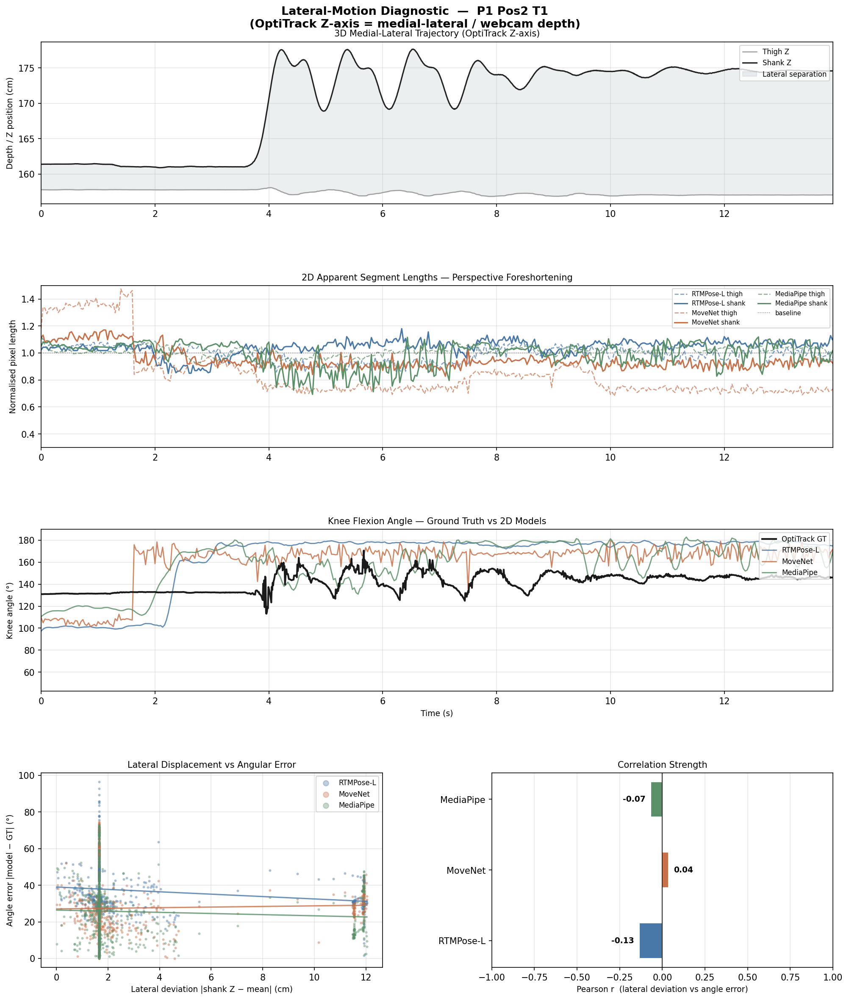

# Weekly Progress Report — Pendulastic
**Week of:** August 4 – August 10, 2026
**Prepared by:** Claire Kennedy (research assistant)
**Prepared for:** Project supervisor

---

## 1. Greeting & Overview

Hi — here's a summary of last week's progress on Pendulastic. It was a heavy build week (~150 commits across Aug 4–7, no activity over the weekend). The main thrust was closing the loop between our two clinical validation axes — **MAS-vs-PT-score agreement** and **MS-vs-Control group separation** — and giving the in-app MAS entry workflow a real UI so scores no longer have to be hand-edited into a CSV. Alongside that, a scheduled nightly code-hygiene agent went live and has already run three times, and we absorbed a large batch of previously-uncommitted analysis/calibration scripts into version control so they're no longer at risk of being lost to a local-only working copy.

No participant data lives in this environment, so nothing below reflects a specific participant's clinical outcome — it's a status report on the pipeline and tooling.

## 2. Key Work & Development Done

**Clinical validation pipelines**
- Added `pt_cohort_common.py`: MS-vs-Control classification (metadata.json + registry priority), participant-level median aggregation (to avoid trial-level pseudoreplication), Mann-Whitney/Cliff's-delta group-separation stats, a cohort composition audit trail, and a light/clinical-style comparison figure — then wired the whole thing to run automatically at the end of every `run_pt_analysis.py` invocation (`f0952e0`, `965453c`, `7a41b4b`).
- Added `mas_validation.py`: MAS-vs-PT-score clinical validation and threshold-fitting (`4673cb6`), plus `append_mas_score()` for writing new MAS entries into `mas_scores.csv` with allowlisted, safety-checked header widening (`c76033b`, `28fa3e7`, and a same-day fix to refuse widening on a blank first line, `4c7c54d`).
- Report generation is no longer gated on hitting a fixed trial-count threshold — some sessions never accumulate `TRIAL_THRESHOLD` (4) trials per leg and would otherwise never generate a report. It now fires 30 minutes after a participant's first discoverable recording, using whatever trials exist at that point (`7500c4e`).

**MAS entry UI**
- Built out `MasEntryPanel` end-to-end inside `pendulastic_app.py`: skeleton + nav wiring → live dashboard refresh (on open, not just after Save) → Save/Export buttons → Stronger Leg + Notes fields → export-error handling and save confirmation (`61694ec` → `8d4a4aa`, seven incremental commits). This replaces manual CSV editing for MAS score entry.

**Trial-quality bookkeeping**
- Added `excluded_trials.json`, a registry of trials an operator has confirmed as non-viable (see §4), and wired `discover_all_trials()` to filter against it so excluded trials never silently leak into a report or the RMSE pipeline (`e716c8a`).

**Housekeeping / infra**
- Committed a batch of previously-local-only analysis and calibration scripts (`align_and_calibrate.py`, `train_angle_regressor.py`, `validate_tracking.py`, and 15 others) along with their tests — these existed only as working-copy files before this week (`4f45334`).
- The nightly code-hygiene agent (spec'd and built this week, `1c83c3c` → `7f932dd` → `63b7839`) produced its first two real reports on 2026-08-06 and 2026-08-07; the 08-06 report's approved items (15, 17, 29–70, 89, 96 — mostly gitignore cleanup) were applied same-day (`8e71f17`).
- Four design specs went in for next-sprint work that hasn't started yet: stateful MediaPipe patient-identity tracking, an IMU-hotspot phone-pairing setup helper, an RMSE validation pipeline, and a trial-exclusion UI panel in `AnalysisPanel` (currently spec-only, no code).

## 3. Visuals, Figures & UI State

Straight answer up front: **no new figures were generated by the pipeline this week in this environment**, because there's no participant recording data present here to run `run_pt_analysis.py` against. The two new figure-producing code paths that shipped this week —

- `mas_validation.py` → `mas_validation_figure.png`
- `pt_cohort_common.py` → `ms_vs_control_boxplots.png`

— write into `Model_Analysis_Outputs/`, which currently contains only two RMSE CSVs and no PNGs. I'd want to run both against real data on a machine that has the recordings before I can show you what they look like.

The most recent figures actually checked into the repo are four PNGs from the acquisition-screen restyle work (`lateral_impact_presentation.png`, `lateral_impact_presentation_P1_Pos2_T1.png`, `oneoff_lateral_check.png`, `oneoff_lateral_check_P1_Pos2_T1.png`) — one-off lateral-view calibration checks, not this week's new validation output:

Similarly, I don't have a dashboard screenshot to include — the `MasEntryPanel`/`DashboardView` UI work landed this week but I haven't captured a screenshot of it running. Happy to grab one next week if that's useful for your review.

## 4. Roadblocks, Errors, & Solutions

- **Non-passive trials contaminating PT-score physics.** The operator confirmed that participant P15 used their own muscles to actively stop the pendulum swing on 5 trials (left T2/T4/T5, right T2/T3) instead of a passive release, which invalidates the Popovic PT-score physics for those trials. Fix: added `excluded_trials.json` as a shared registry and filtered it into `discover_all_trials()` so those trials are dropped from every report/sweep rather than needing to remember to exclude them by hand each time (`e716c8a`).
- **Marker-tracking quality flag on nearly every trial.** `p13_full_report.py`/`p13_leg_session_comparison.py` carry a standing caveat that every trial shows an area-ratio quality warning from duo-session marker tracking, and since area_ratio feeds the 7-parameter score directly, this is part of why scores cluster in the "Impaired" zone for that reference participant. This is flagged as a known caveat in the report output rather than silently affecting scores — it hasn't been root-caused yet (see open question in §5).
- **Trial-count gating left some sessions with no report at all.** Sessions that don't reach 4 trials per leg were being skipped indefinitely. Fixed by switching the gate to "30 minutes since first recording" instead of a trial-count floor (`7500c4e`).
- **CSV-widening safety.** Two same-day follow-up fixes on `append_mas_score()`: it was allowed to widen `mas_scores.csv`'s header on a blank first line (now refused, `4c7c54d`), and the allowlist enforcement on which columns could be added was too loose (tightened, `28fa3e7`).
- **Hygiene-agent false positives.** The nightly hygiene agent initially flagged the main-branch worktree itself as safe to delete and mis-invoked `vulture` against an unactivated venv; both fixed same-day the bugs were caught (`03f5cbf`, `67313a7`).
- I could not run the test suite in this environment (no `pytest` installed here), so I can't report a pass/fail count for this week's changes from this machine — will confirm on the dev box.

## 5. Questions & Request for Feedback

1. On the area-ratio/marker-tracking caveat in §4 — is this worth root-causing now (e.g. re-checking camera placement or marker visibility for duo-session recordings), or is it acceptable to keep reporting it as a caveat alongside the score for the time being?
2. For `excluded_trials.json`: right now exclusion requires an operator to explicitly confirm "non-passive swing" after the fact. Would you want a lighter-weight in-session flag (e.g. a button during acquisition) so we catch these before the participant leaves, rather than relying on someone noticing it in review later?
3. The MS-vs-Control comparison now runs automatically after every `run_pt_analysis.py` call. Is that the right trigger, or should it stay a separate, manually-invoked step until we have more participants in the Control arm?
4. Four design specs (patient-identity tracking, IMU hotspot pairing, RMSE validation pipeline, trial-exclusion UI) are written but not yet implemented — could you help me rank these against the MediaPipe patient-identity spec, since that one blocks multi-patient sessions?

## 6. Next Week's Action Plan

- Implement the RMSE validation pipeline against the spec finalized this week (`rmse-validation-pipeline-design.md`), filtering against the same `excluded_trials.json` registry.
- Build the trial-exclusion UI panel in `AnalysisPanel` so operators can flag non-viable trials in-app instead of hand-editing the JSON registry.
- Run `mas_validation.py` and `pt_cohort_common.py` against real recorded data on the lab machine and bring back the actual figures (blocked here on data access, see §3).
- Start implementation on the stateful MediaPipe patient-identity tracking spec, pending your ranking from §5.
- Continue triaging nightly hygiene reports as they land; apply low-risk `[Safe to Delete]`/`[Gitignore Candidate]` items promptly, leave `[Needs Review]` items for discussion.
