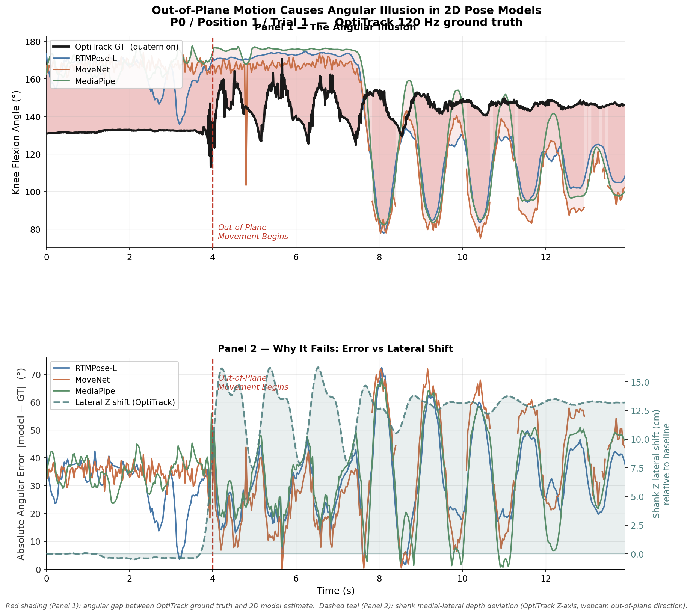
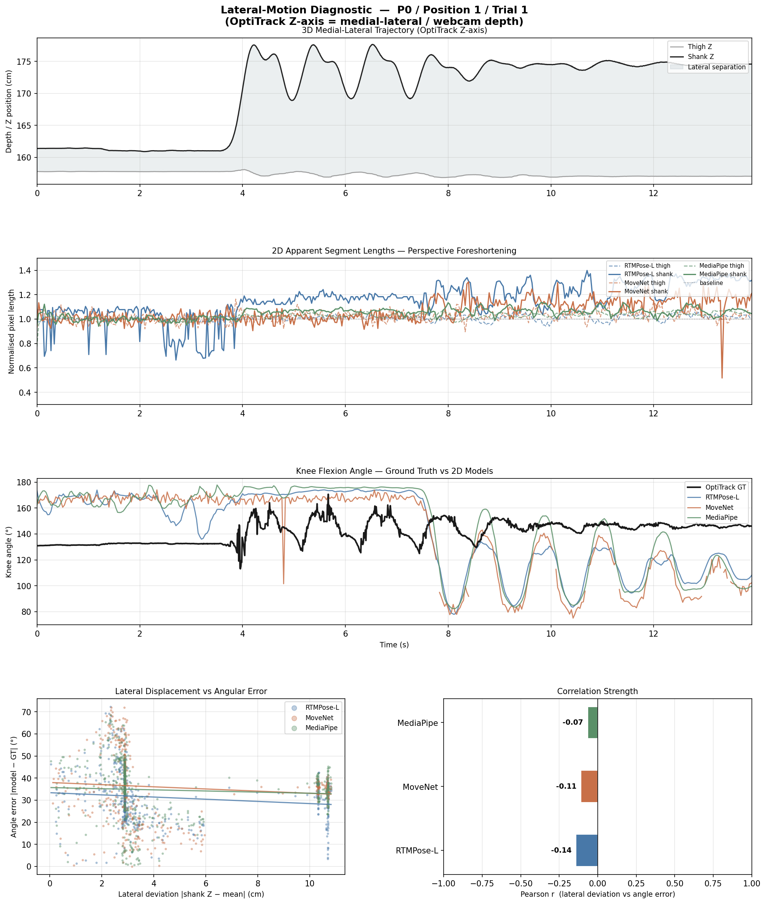

# Pendulastic — Weekly Progress Report

**To:** Project Supervisor
**From:** Claude (assisting on Pendulastic development)
**Week of:** August 10–17, 2026

## 1. Greeting & Overview

Hi — here's a summary of last week's work on Pendulastic. The week's focus was split across three fronts: closing out the multi-trial recording and trial-quality-triage workflow, shipping a browser-based phone IMU capture path (no companion app install required), and adding retracking/review tooling for the HPE pipeline. On the ML side, the angle-regressor training pipeline got resume/checkpointing support and a couple of real crash fixes from an overnight training run. One architectural cleanup — removing the standalone Workbench entry point — also landed. Roughly 190 commits touched the branch this week; I've grouped the substantive ones below rather than listing all of them.

## 2. Key Work & Development Done

- **Multi-trial recording & session trial list** — a new checkbox lets a session record multiple trials back-to-back, with a live trial list (view/delete, processing placeholder) instead of forcing the review screen after every single trial. (`6496183`, `45b5115`, `0ffe61b`, `5951790`, `caa4092`, `a318c88`, `cfcac56`)
- **Trial quality triage** — new signal computation + suggestion rule for flagging questionable trials, an exclusion-writer registry, and a "Flag Trial Quality" button/dialog wired into the Workbench UI. (`4acf7aa`, `c057d03`, `70163ec`, `e8df063`, merged `40da078`)
- **Phone IMU (browser) streaming** — a browser-based accel+gyro capture page that needs no app install, served over a single-port HTTPS+WS stream server, with a bridge translating browser samples into our existing Sensor-Stream format. Wired into the Acquisition panel as a new option. (`30ed34f`, `af1782d`, `1bd05e7`, merged `8e87c41`; UI: `cabc063`, `f680045`)
- **Annotated video review / retracking** — a new `AnnotatedVideoReviewDialog` (scrub + playback) that now opens automatically once HPE tracking finishes, plus "Fix Person Here" wired through to repick → retrack → length-safe splice. Builds on the "Pick Person" dialog from the prior week. (`f1eb3aa`, `f7259fc`, `73ba66a`, `e5eb822`, `c44c818`)
- **MediaPipe preprocessing** — rotate-to-upright + pixel-space knee-angle helper, motion-based moving-leg crop, and a non-gating preprocessing sweep across the full dataset. (`d1f361a`, `b0e79f1`, `763ac4e`, `88b40ef`)
- **Training pipeline** — `--resume` and per-trial checkpointing added to `gen_training_data.py`; `--resume` added to angle-regressor training with `EarlyStopping` patience now honored across restarts; horizontal-flip + hue/saturation jitter augmentation added. (`fb9edb3`, `c4bbcc7`, `056ff4d`, `f526d63`, `3af723c`)
- **Architecture cleanup** — removed the standalone Workbench entry point, consolidating everything into the embedded app. (`ab1c522`, merged `20e14fe`)

## 3. Visuals, Figures & UI State

I want to be upfront rather than paper over this: **no new figures, plots, or dashboard screenshots were produced this week.** I checked the repo for anything new — chart-generating scripts (`plot_comprehensive_parameter_matrix.py`, `plot_multisource_trials.py`, `plot_model_vs_optitrack_comparison.py`, etc.) all exist but weren't run against real data this week, and `data/results/` / `data/processed/` contain only placeholder files. The only PNGs in the repo are four pre-existing calibration images from late July (`lateral_impact_presentation.png`, `oneoff_lateral_check.png`, and their `_P1_Pos2_T1` variants) — they were mechanically re-touched by a hygiene-report merge on Aug 10 but have no new content:

There is also still no screenshot of the current Workbench UI (Flag Trial Quality dialog, Annotated Video Review dialog, or the new Phone IMU browser page) — everything shipped this week is Tkinter/browser code with no captured image to show you. This carries over unresolved from last week's report. I'd like to prioritize getting real output plots and at least one UI screenshot into next week's report rather than repeating this note a third time.

## 4. Roadblocks, Errors, & Solutions

- **Overnight training crash** — hit three separate issues in one run: a `UnicodeEncodeError` from stdout redirection, a Keras `TypeError` from `ReduceLROnPlateau` being incompatible with the `CosineDecayRestarts` schedule, and a TFLite full-integer conversion crash with no representative samples. Also found the ShankOLC loss was operating on a raw-pixel scale (~1e4–1e5) versus the angle loss's normalized scale (~1e-2), which was starving the angle head — renormalized. All fixed in one pass (`9452168`).
- **Phase 2 fine-tune divergence** — after unfreezing the backbone, validation RMSE climbed 25.5° → 39.5° over successive epochs. Root cause: `FINETUNE_LR` was left equal to `HEAD_LR` (1e-3), which was destroying the pretrained backbone. Dropped it 10x. (`d4c9fd3`)
- **Silent empty validation set** — `VAL_PARTICIPANTS` still held pre-reorg participant IDs from before the Aug 4 folder restructure, so validation had been silently running on zero samples. Fixed and re-verified (11,085 val / 23,799 train samples). (`28cc636`)
- **Retrack dialog permanent lock** — engine failures during retracking could leave the Annotated Video Review dialog stuck unusable; now handled. (`d100c12`)
- **Unbounded IMU buffer growth** — the browser IMU page's send buffer grew without bound during WebSocket outages; now drops samples when the socket isn't open. (`1b9f500`)
- **OptiTrack/Motive sync mismatch** — fixed trigger ordering and relpath handling so Motive sync matches `master_app`. (`b4c5c73`)
- **Regression from the Workbench removal** — the standalone-entry-point cleanup accidentally dropped a `reset_for_new_trial()` call, which could carry stale release marks into a newly loaded trial. Caught and restored same week. (`e743019`)

**Still unresolved, carried over from last week:** the marker-tracking data-quality warning that fires on nearly every trial for the reference participant still hasn't been root-caused. The new Trial Quality Triage feature (flag/exclude) is a mitigation that lets us work around it, not a fix — flagging in case you'd rather we spend time on the root cause than keep building around it.

## 5. Questions & Request for Feedback

A few real open decisions came up in this week's planning notes (`docs/ideation/2026-08-14-pendulastic-improvements-ideation.html`) that I'd like your read on:

1. **`src/pendulastic` limbo.** There's ~983 lines of code there that looks maintained but isn't imported by any of our three production entry points. Should we consolidate it into the active codebase, or is it safe to delete? I'd rather have you make that call on purpose than have it happen by accident during some future cleanup pass.
2. **Regulatory/intended-use framing.** The app already emits a predicted clinical grade in the UI. Do you want that explicitly labeled as a research estimate (vs. a clinical output) at the UI level, or is the current framing intentional? This feels like a decision that should be made deliberately rather than left implicit.
3. **RMSE validation cadence.** We walked back an earlier idea of an automated nightly "golden-trial" validation job (a reviewer flagged risk in that approach) in favor of a locked trial manifest with paired per-trial RMSE comparisons, run manually for now. Does that match what you want, or should we still be aiming for something scheduled/automatic once it's proven out?
4. **Video+IMU fusion.** This is the most speculative item on our list (I'd put it at maybe 55% confidence it's worth pursuing) — a hybrid model-driven + data-driven fusion approach. Worth scoping in more detail, or should we deprioritize it in favor of the more concrete items above?

## 6. Next Week's Action Plan

- Run the existing plotting scripts against real recorded data and get actual output figures into the repo — this has now been an open item for two weeks running.
- Get at least one screenshot of the current Workbench UI (Flag Trial Quality dialog, Annotated Video Review dialog, Phone IMU browser page) into the next report.
- Decide on the `src/pendulastic` consolidate-vs-delete question above so it doesn't linger further.
- Take a pass at root-causing the marker-tracking warning rather than continuing to route around it with trial exclusion.
- Continue training-pipeline work now that resume/checkpointing is in place — validate the renormalized ShankOLC loss and the corrected fine-tune LR hold up over a full run.

---

*Note on process: this report was generated by reviewing git commit history and repository contents directly, not from a transcript of verbal instructions — please flag anything above that doesn't match your expectations.*
